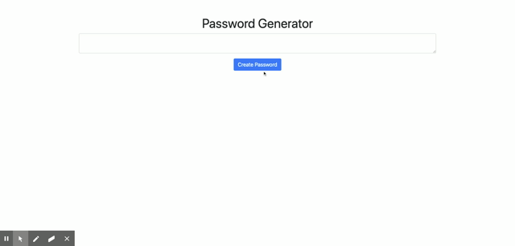

<h1 align='center'>Create Portfolio Using BootStrap</h1>
<h2>💡 Project Overview</h2>
<p>Create an application that generates a random password based on user-selected criteria. This app will run in the browser and feature dynamically updated HTML and CSS powered by your JavaScript code. It will also feature a clean and polished user interface and be responsive, ensuring that it adapts to multiple screen sizes.
<a href='https://juanlajara.github.io/PasswordGenerator/' target='_blank'>Live PW Generator Link</a>
</p>

## User Story

```
AS AN employee with access to sensitive data
I WANT to randomly generate a password that meets certain criteria
SO THAT I can create a strong password that provides greater security
```

<h2>⚙️ List of Technology Used</h2>
<ul>
    <li>HTML</li>
    <li>CSS</li>
    <li>BootStrap</li>
    <li>JavaScript</li>
</ul>
<h2>📓 Contributor(s)</h2>
<p>Dre</p>
<ul>
    <li><a href='https://github.com/juanlajara/juanlajara.github.io' target='_blank'>GitHub</a></li>
    <li><a href='https://www.linkedin.com/in/juan-andres-lajara-179a8442' target='_blank'>LinkedIn</a></li>
    <li>juanlajara001@gmail.com</li>
</ul>

<h2>⚓ Minimum Requirements</h2>

### Acceptance Criteria

- GIVEN I need a new, secure password
- WHEN I click the button to generate a password
- THEN I am presented with a series of prompts for password criteria
- WHEN prompted for password criteria
- THEN I select which criteria to include in the password
- WHEN prompted for the length of the password
- THEN I choose a length of at least 8 characters and no more than 128 characters
- WHEN prompted for character types to include in the password
- THEN I choose lowercase, uppercase, numeric, and/or special characters
- WHEN I answer each prompt
- THEN my input should be validated and at least one character type should be selected
- WHEN all prompts are answered
- THEN a password is generated that matches the selected criteria
- WHEN the password is generated
- THEN the password is either displayed in an alert or written to the page

The following image demonstrates the application functionality:



../media/playerprofile-mobile.png?raw=true
